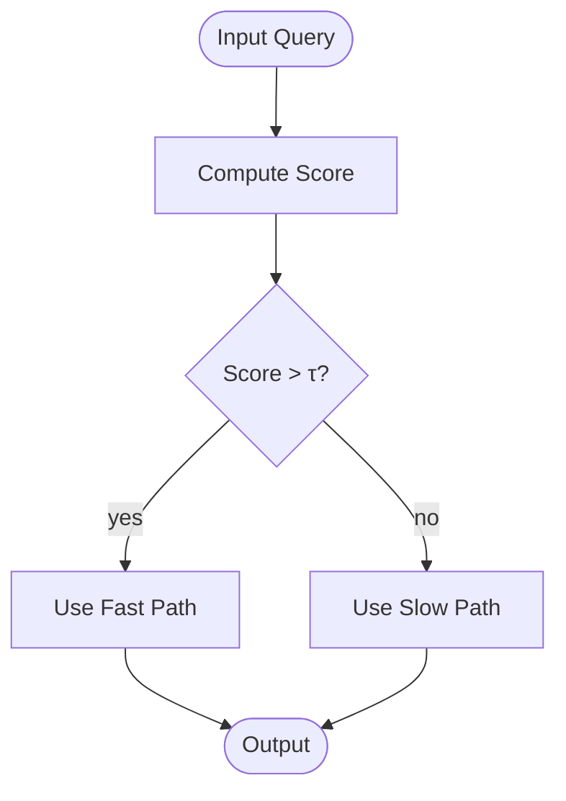

# 分支流程图 · Branched / Decision Flowchart

> **何时用**：流程中含**判断节点**（菱形），根据条件分叉到不同路径

## 🎨 预期输出长什么样

```
            ┌──────────────┐
            │ Input Query  │  ← 蓝色椭圆（起点）
            └──────┬───────┘
                   │
            ┌──────▼───────┐
            │ Compute      │  ← 灰色矩形（过程）
            │ Score        │
            └──────┬───────┘
                   │
              ╱────▼────╲
             ╱  Score > τ ╲   ← 橙色菱形（判断）
             ╲   ?       ╱
              ╲────┬────╱
              yes  │  no
        ┌─────────┘   └─────────┐
        ▼                       ▼
┌─────────────┐         ┌─────────────┐
│ Use Fast    │         │ Use Slow    │  ← 绿/红矩形（分支）
│ Path        │         │ Path        │
└──────┬──────┘         └──────┬──────┘
       │                       │
       └───────────┬───────────┘
                   ▼
            ┌─────────────┐
            │   Output    │  ← 椭圆（结束）
            └─────────────┘
```

垂直布局，含菱形判断节点，根据 yes/no 分两路，最后汇合。

---

## 📋 完整 Prompt（复制下方代码块全部内容）

```text
A branched flowchart with decision points for an academic paper on {主题}.

LAYOUT: Top-to-bottom vertical flow. Start at top, end at bottom. Branches expand horizontally at decision points.

NODES:
- Start: rounded oval with thick border, label "{起点名}", soft blue fill #D6E4F0
- Process A: rounded rectangle, label "{过程 A 名}", soft gray fill
- Decision 1: diamond shape, label "{判断条件}?", soft orange fill #F5E0CB, with two outgoing branches
- Branch Yes (Process B): rounded rectangle (left), label "{yes 分支名}", soft green fill #D8E8D0
- Branch No (Process C): rounded rectangle (right), label "{no 分支名}", soft red fill #E8D0D0
- Merge / End: rounded oval, label "{结束名}", thick border

CONNECTIONS:
- Start → Process A: solid arrow, no label
- Process A → Decision 1: solid arrow, no label
- Decision 1 → Branch Yes: solid arrow, label "yes" in italic gray near the start of the arrow
- Decision 1 → Branch No: solid arrow, label "no" in italic gray near the start of the arrow
- Branch Yes → End: solid arrow, curving slightly inward to merge
- Branch No → End: solid arrow, curving slightly inward to merge
- All arrows 2-3 px thick, solid black

TEXT:
- Title at top center, bold Arial: "{图标题}"
- All node labels in bold Arial, ≤ 4 words each
- Decision label phrased as a yes/no question (ends with "?")

STYLE: flat vector, Arial sans-serif, pastel palette, pure white background, academic publication style. Aspect ratio 4:3 or 3:4 (vertical).

Negative constraints: NO photorealistic, NO 3D, NO drop shadows, NO cartoon, NO ambiguous arrows (every branch must be labeled), NO three-way decisions (use only binary decisions; for ternary use nested decisions), NO long sentences in nodes, NO emoji.
```

---

## 🛠 使用方法

复制完整 prompt → 替换 `{占位符}` → 送入图像生成模型。

## ✏️ 填空示例（自适应路由算法）

```text
A branched flowchart with decision points for an academic paper on adaptive routing.

LAYOUT: Top-to-bottom vertical flow ...

NODES:
- Start: rounded oval, label "Input Query", soft blue fill
- Process A: rounded rectangle, label "Compute Score", soft gray fill
- Decision 1: diamond shape, label "Score > τ?", soft orange fill
- Branch Yes: rounded rectangle (left), label "Use Fast Path", soft green fill
- Branch No: rounded rectangle (right), label "Use Slow Path", soft red fill
- End: rounded oval, label "Output", thick border

...
```

## 💡 调优提示

- **多于一个判断节点**：把同样的"Decision N → Branch Yes/No"模式重复，每个判断节点单独定义
- **判断有三个或更多分支**：拆成多个二元判断的嵌套（"先判 A 否，再在 B 中判"）
- **yes/no 不够直观**：用具体条件值，如"label='yes, score > 0.8'" 替代"yes"

## 🔁 Mermaid 等价代码（可选，矢量输出）



## 🔗 相关

- 简单顺序（无判断）→ [linear.md](linear.md)
- 并行多分支 → [parallel.md](parallel.md)
- 循环判断 → [loop.md](loop.md)
