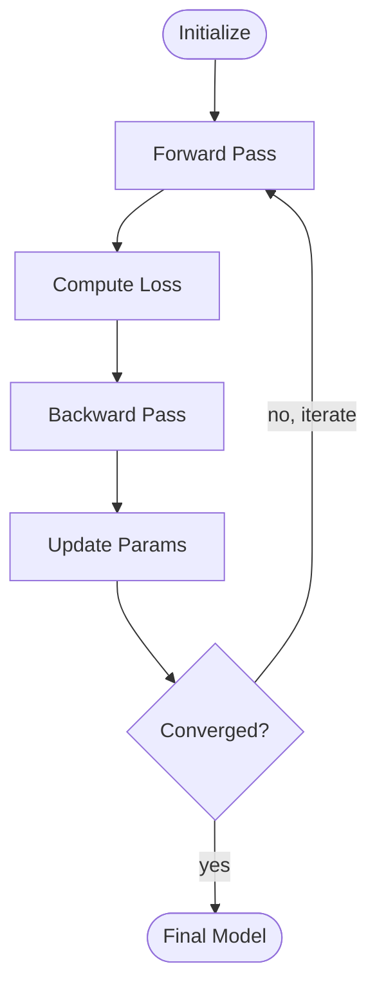

# 循环流程图 · Loop Flowchart

> **何时用**：含**闭环箭头**的流程——训练循环、迭代优化、EM 算法、闭环控制、强化学习

## 🎨 预期输出长什么样

```
        ┌──────────────────┐
        │ Initialize Param │   ← 蓝色椭圆（起点）
        └─────────┬────────┘
                  ▼
        ┌──────────────────┐
        │  Forward Pass    │   ← 灰色
        └─────────┬────────┘
                  ▼
        ┌──────────────────┐
        │  Compute Loss    │   ← 灰色
        └─────────┬────────┘
                  ▼
        ┌──────────────────┐
        │  Backward Pass   │   ← 灰色          
        └─────────┬────────┘            ╲
                  ▼                      ╲
        ┌──────────────────┐              ╲
        │ Update Params    │   ← 灰色      │  ← 反馈循环
        └─────────┬────────┘              │     红色粗箭头
                  ▼                       │     标 "no, iterate"
              ╱──────╲                    │
             ╱Converged╲ ← 橙色菱形       │
             ╲   ?    ╱                   │
              ╲──┬──╱                     │
            yes  │                        │
                 │   ◀────────────────────╯
                 ▼
        ┌──────────────────┐
        │  Final Model     │   ← 绿色椭圆（结束）
        └──────────────────┘
```

垂直主流向 + 右侧**红色粗弧线**回到起点附近，明显区别于主流向。

---

## 📋 完整 Prompt（复制下方代码块全部内容）

```text
A loop flowchart for an academic paper on {主题，如 iterative training}, emphasizing the iterative nature of the process.

LAYOUT: Vertical top-to-bottom main flow with one explicit feedback loop arrow returning from a lower node to an upper node.

NODES:
- Start: rounded oval, label "{初始化节点名}", soft blue fill #D6E4F0
- Iterate step 1: rounded rectangle, label "{步骤 1 名}", soft gray fill
- Iterate step 2: rounded rectangle, label "{步骤 2 名}", soft gray fill
- Iterate step 3: rounded rectangle, label "{步骤 3 名}", soft gray fill
- Iterate step 4: rounded rectangle, label "{步骤 4 名}", soft gray fill
- Decision: diamond shape, label "{收敛判断}?", soft orange fill #F5E0CB
- End: rounded oval with thick border, label "{终态名}", soft green fill

CONNECTIONS:
- Sequential solid arrows downward: Start → Step 1 → Step 2 → Step 3 → Step 4 → Decision
- Decision → End: solid arrow downward, label "yes" in italic gray
- **Feedback arrow**: Decision → Step 1, drawn as a thick curved arrow on the right side of the diagram, going from the right side of the Decision diamond back up to the right side of Step 1. Label this arrow "no, iterate" in bold italic gray. Use a slightly different color (e.g., soft red #C44E52) to make it visually stand out.

TEXT:
- Title at top center, bold Arial: "{图标题}"
- Node labels: bold Arial, ≤ 3 words each
- Side annotation at the right of the feedback arrow (small italic gray): "Repeat until {终止条件}"

STYLE: flat vector, ICLR / NeurIPS figure aesthetic, Arial sans-serif, pastel palette, pure white background. Aspect ratio 3:4 (vertical, taller than wide).

Negative constraints: NO photorealistic, NO 3D shading, NO drop shadows, NO cartoon, NO ambiguous feedback (the loop arrow must be visually distinct from the forward arrows), NO arrows crossing the main flow chaotically, NO emoji.
```

---

## ✏️ 填空示例（训练循环）

```text
{主题} = iterative training
{初始化节点名} = Initialize Parameters
{步骤 1 名} = Forward Pass
{步骤 2 名} = Compute Loss
{步骤 3 名} = Backward Pass
{步骤 4 名} = Update Parameters
{收敛判断} = Converged
{终态名} = Final Model
{图标题} = Iterative Training Loop
{终止条件} = loss converges
```

## 💡 调优提示

- **循环箭头看不出来**：在 prompt 中加强语气 "feedback arrow MUST use a distinctly different color (red), be thicker (4-5 px), and be the only curved arrow"
- **循环回到不同的节点**：把 `back up to Step 1` 改为 `back up to Step 2` 或 `back up to Start`
- **多重嵌套循环**：在 prompt 中加 "two feedback loops: outer loop from Decision-A to Step-1, inner loop from Decision-B to Step-3"
- **强化学习的 reward loop**：把 feedback 标签改为 "reward signal" / "policy update"

## 🔁 Mermaid 等价代码



## 🔗 相关

- 简单顺序（无循环）→ [linear.md](linear.md)
- 单纯判断分支 → [branched.md](branched.md)
- 嵌套子流程 → [nested.md](nested.md)
