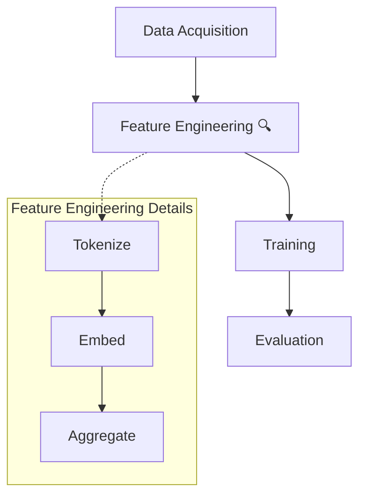

# 嵌套 / 层级流程图 · Nested Flowchart

> **何时用**：高层流程的**某一步**需要展开为子流程（如 "Step B" 内部还有 3 个子步骤）

## 🎨 预期输出长什么样

```
顶层（Tier 1）—— 主流程横向：

  ┌──────────────┐  ┌────────────────┐  ┌──────────┐  ┌──────────┐
  │ Data Acquire │─▶│ Feature Eng  🔍│─▶│ Training │─▶│ Evaluate │
  └──────────────┘  └───────┬────────┘  └──────────┘  └──────────┘
                            │
                            │ 虚线指向下方"展开视图"
                            ▼
  ┌─────────────────────────────────────────────────────┐
  │ Step B Details ........... (虚线框，半透明背景)    │
  │                                                     │
  │  ┌──────────┐    ┌──────────┐    ┌──────────────┐  │
  │  │ Tokenize │──▶ │  Embed   │──▶ │  Aggregate   │  │  ← 子流程展开
  │  └──────────┘    └──────────┘    └──────────────┘  │
  │                                                     │
  └─────────────────────────────────────────────────────┘
```

两层结构：上层主流程 + 用虚线框标记的"被展开的子流程"。

---

## 📋 完整 Prompt（复制下方代码块全部内容）

```text
A nested flowchart for an academic paper on {主题，如 multi-stage processing}, where one of the high-level steps is expanded into a detailed sub-flowchart.

LAYOUT: Two-tier vertical flow.

TIER 1 (top, main flow): A horizontal high-level flow with {主流程节点数，如 four} nodes:
- High-level step A: rounded rectangle, label "{步骤 A 名}", soft blue fill
- High-level step B: rounded rectangle with a small "magnifying glass" icon on its top-right corner, label "{步骤 B 名}", soft green fill — this is the "zoomed-in" step
- High-level step C: rounded rectangle, label "{步骤 C 名}", soft orange fill
- High-level step D: rounded rectangle, label "{步骤 D 名}", soft purple fill

TIER 2 (bottom, expanded sub-flow): A large dashed rectangle (labeled "{被展开步骤} Details" at top-left) containing 3-5 sub-process nodes:
- Sub-step B1: rounded rectangle, label "{子步骤 1 名}"
- Sub-step B2: rounded rectangle, label "{子步骤 2 名}"
- Sub-step B3: rounded rectangle, label "{子步骤 3 名}"

CONNECTIONS:
- Tier 1: Horizontal solid arrows A → B → C → D
- A thin dashed line (or two dashed lines) connecting High-level step B to the dashed sub-rectangle below, indicating "this is the expanded view"
- Tier 2: Horizontal solid arrows B1 → B2 → B3 within the dashed rectangle

TEXT:
- Title at top, bold Arial: "{图标题}"
- All node labels in bold Arial, ≤ 3 words
- Caption below the dashed rectangle in italic gray: "{被展开步骤} expanded for clarity."

STYLE: flat vector, academic publication style, Arial sans-serif, pastel palette, pure white background. Aspect ratio 16:9.

Negative constraints: NO photorealistic, NO 3D shading, NO heavy drop shadows, NO cartoon, NO ambiguous "expansion" markers (the dashed connection must be visually clear), NO emoji, NO overcrowded sub-flow (max 5 sub-steps).
```

---

## ✏️ 填空示例（特征工程展开）

```text
{主题} = multi-stage NLP processing
{主流程节点数} = four
{步骤 A 名} = Data Acquisition
{步骤 B 名} = Feature Engineering
{步骤 C 名} = Model Training
{步骤 D 名} = Evaluation
{被展开步骤} = Feature Engineering
{子步骤 1 名} = Tokenize
{子步骤 2 名} = Embed
{子步骤 3 名} = Aggregate
{图标题} = Method Overview with Feature Engineering Expansion
```

## 💡 调优提示

- **想展开多个步骤**：把 prompt 复制两份，每份展开一个不同 step
- **子流程内有判断或循环**：在子流程区域参考 `branched.md` / `loop.md` 模板
- **虚线连接不明显**：在 prompt 中加 "the dashed connector from Step B to the sub-rectangle must be at least 3 px thick and clearly distinguishable from solid arrows"

## 🔁 Mermaid 等价代码（含子图 subgraph）



## 🔗 相关

- 单层主流程 → [linear.md](linear.md)
- 多组件复杂系统总览 → [../architecture/system-overview.md](../architecture/system-overview.md)
