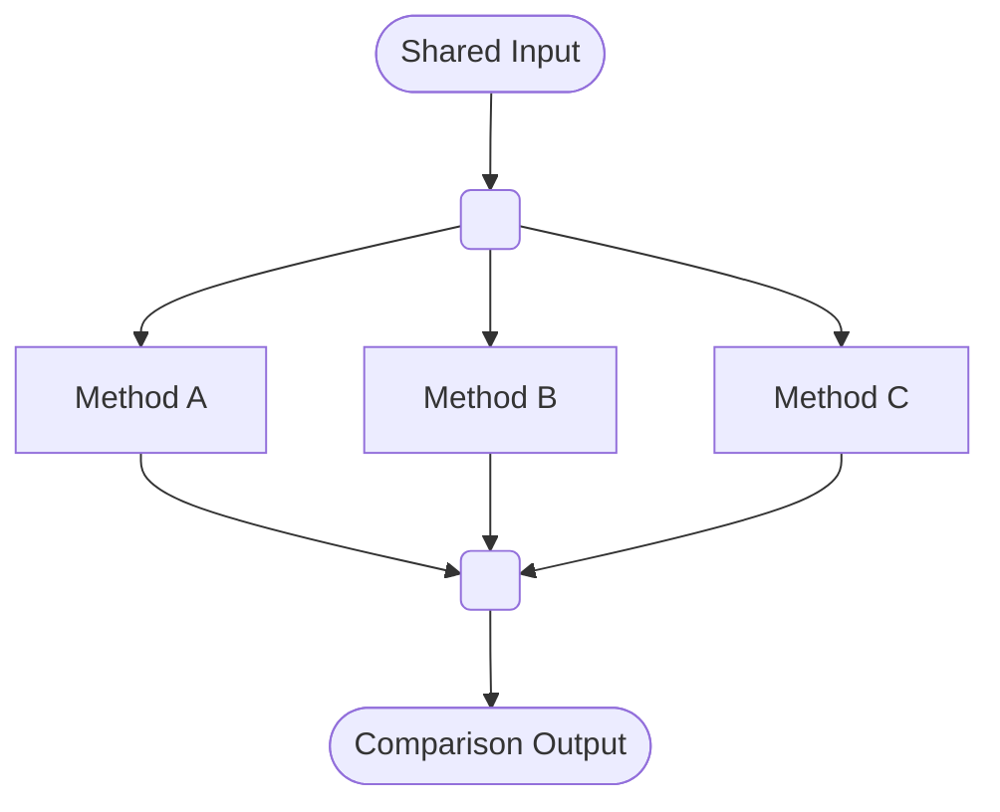

# 并行流程图 · Parallel Flowchart

> **何时用**：一个输入**同时**分发到多条独立路径，最后汇合一个输出。典型场景：消融对比、多线程算法、并行处理

## 🎨 预期输出长什么样

```
            ┌─────────────────┐
            │  Shared Input   │  ← 蓝色（起点）
            └────────┬────────┘
                     ▼
                     ●         ← 分发点（fork）
            ┌────────┼────────┐
            ▼        ▼        ▼
       ┌────────┐┌────────┐┌────────┐
       │Method A││Method B││Method C│  ← 绿/橙/紫色（三条并行支路）
       └───┬────┘└───┬────┘└───┬────┘
           │         │         │
           └─────────●─────────┘    ← 汇合点（join）
                     ▼
            ┌─────────────────┐
            │ Comparison Out  │  ← 灰色（终点）
            └─────────────────┘
```

垂直布局，1 个输入 → 分发 → 多个并行支路 → 汇合 → 1 个输出。

---

## 📋 完整 Prompt（复制下方代码块全部内容）

```text
A parallel flowchart showing concurrent processes for an academic paper on {主题，如 ablation comparison}.

LAYOUT: Horizontal top-to-bottom flow with a split-merge structure. One input at top splits into {并行分支数量，如 three} parallel paths, which then merge into one output at bottom.

NODES:
- Input: rounded oval, label "{输入节点名}", soft blue fill #D6E4F0
- Fork (split point): small filled black circle (radius 6 px)
- Parallel branch 1 (left): rounded rectangle, label "{分支 1 名}", soft green fill #D8E8D0
- Parallel branch 2 (middle): rounded rectangle, label "{分支 2 名}", soft orange fill #F5E0CB
- Parallel branch 3 (right): rounded rectangle, label "{分支 3 名}", soft purple fill #E0D4EC
- Join (merge point): small filled black circle (radius 6 px)
- Output: rounded oval, label "{输出节点名}", soft gray fill

CONNECTIONS:
- Input → Fork: solid arrow downward
- Fork → 3 branches: solid arrows diverging downward to each branch
- Each branch → Join: solid arrows converging downward
- Join → Output: solid arrow downward
- Optionally, label each branch arrow with the differentiating aspect (e.g., "with feature X", "without feature X", "with feature Y")

OPTIONAL: To indicate strict parallelism, place a horizontal "fork bar" (thin solid black rectangle) at the split and join points instead of dots — UML-style.

TEXT:
- Title at top center, bold Arial: "{图标题}"
- Node labels: bold Arial, ≤ 4 words each
- A short caption at the bottom in italic gray: "All branches share the same input and are evaluated under identical conditions."

STYLE: flat vector, academic publication aesthetic, Arial sans-serif, pastel palette, pure white background. Aspect ratio 3:4 (vertical) or 1:1.

Negative constraints: NO photorealistic, NO 3D, NO drop shadows, NO cartoon, NO crossing branch lines, NO unlabeled differentiation, NO arrows going upward (strict downward flow), NO emoji.
```

---

## 💡 调优提示

- **分支数 ≥ 5**：建议拆成两张图，或改用**分面网格图**
- **每条支路内部还有子步骤**：每个分支用一个 vertical sub-pipeline（参考 `linear.md`）填充
- **想强调"严格同步"**：把 `small filled black circle` 改为 `horizontal fork bar`（UML 标准并行符号）

## 🔁 Mermaid 等价代码



## 🔗 相关

- 单线顺序（无分发）→ [linear.md](linear.md)
- 条件分支（按判断分叉，非并行）→ [branched.md](branched.md)
- A vs B 两路对比图（强调对比而非并行处理）→ [../architecture/comparison.md](../architecture/comparison.md)
