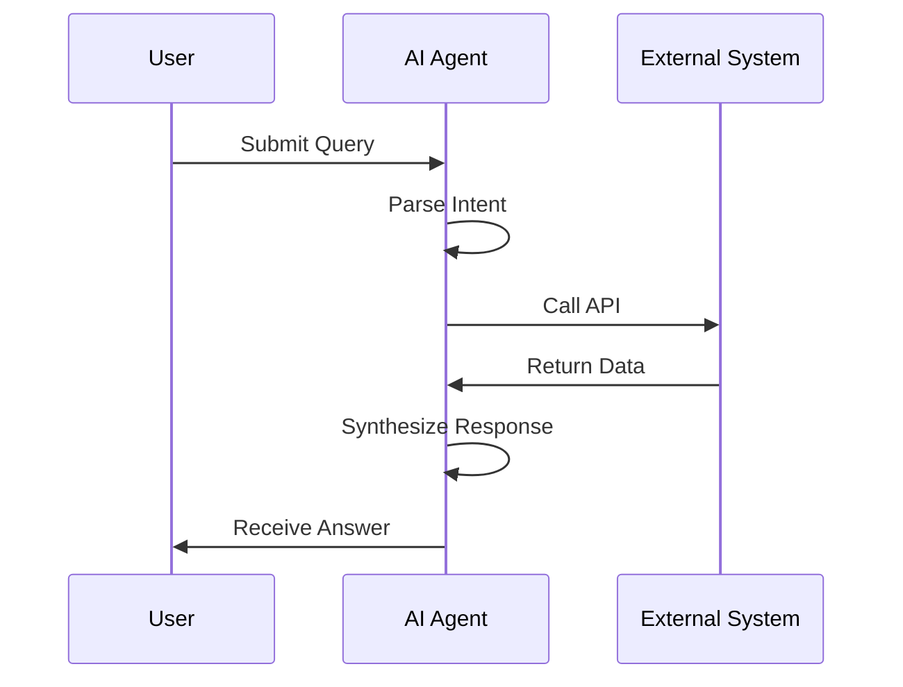

# 泳道流程图 · Swimlane Flowchart

> **何时用**：多个**角色 / 模块 / 系统**协同的流程，需要清楚展示"谁做了什么"

## 🎨 预期输出长什么样

```
┌─────────┬──────────────────────────────────────────────────────────┐
│         │  ┌───────────┐                              ┌──────────┐ │
│  User   │  │ Submit    │                              │ Receive  │ │
│ (蓝色)  │  │  Query    │                              │  Answer  │ │
│         │  └─────┬─────┘                              └────▲─────┘ │
├─────────┼────────┼───────────────────────────────────────┼─────────┤
│         │        │ ┌─────────┐    ┌─────────┐   ┌────────┴────┐   │
│  AI     │        └▶│ Parse   │───▶│ Call    │   │ Synthesize  │   │
│ Agent   │          │ Intent  │    │  API    │   │  Response   │   │
│ (绿色)  │          └─────────┘    └────┬────┘   └─────▲───────┘   │
│         │                              │              │           │
├─────────┼──────────────────────────────┼──────────────┼───────────┤
│External │                              │ ┌──────────┐ │           │
│ System  │                              └▶│ Return   │─┘           │
│ (橙色)  │                                │   Data   │             │
│         │                                └──────────┘             │
└─────────┴──────────────────────────────────────────────────────────┘
```

横向泳道，每条泳道有左侧标签（User / AI / External），节点放在对应泳道，箭头跨泳道时清楚显示"谁传给谁"。

---

## 📋 完整 Prompt（复制下方代码块全部内容）

```text
A swimlane flowchart for an academic paper on {主题，如 human-AI collaboration}, showing how different actors / modules interact across a process.

LAYOUT: {泳道数量，如 three} horizontal swimlanes stacked vertically. Each lane has a label on the left side.

LANES (from top to bottom):
- Lane 1: "{第 1 道角色名}", soft blue background tint #F0F4FA
- Lane 2: "{第 2 道角色名}", soft green background tint #F0FAF4
- Lane 3: "{第 3 道角色名}", soft orange background tint #FAF4F0

Lane separators: thin gray horizontal lines (1 px).

NODES (placed within appropriate lane to show responsibility):
- Step 1 (Lane 1): rounded rectangle, label "{步骤 1 名}"
- Step 2 (Lane 2): rounded rectangle, label "{步骤 2 名}"
- Step 3 (Lane 2): rounded rectangle, label "{步骤 3 名}"
- Step 4 (Lane 3): rounded rectangle, label "{步骤 4 名}"
- Step 5 (Lane 2): rounded rectangle, label "{步骤 5 名}"
- Step 6 (Lane 1): rounded rectangle, label "{步骤 6 名}"

CONNECTIONS:
- Step 1 → Step 2: solid arrow crossing Lane 1 → Lane 2 boundary downward, optionally labeled with the message type
- Step 2 → Step 3: solid arrow within Lane 2
- Step 3 → Step 4: solid arrow crossing Lane 2 → Lane 3 boundary downward, optionally labeled "request"
- Step 4 → Step 5: solid arrow crossing Lane 3 → Lane 2 boundary upward, optionally labeled "response"
- Step 5 → Step 6: solid arrow crossing Lane 2 → Lane 1 boundary upward
- All arrows 2-3 px solid black

TEXT:
- Title at top center, bold Arial: "{图标题}"
- Lane labels: bold Arial, vertically centered on the left edge of each lane
- Node labels: bold Arial, ≤ 3 words

STYLE: flat vector, academic infographic aesthetic, Arial sans-serif, pastel palette, pure white background base with subtle lane tints. Aspect ratio 16:9 or wider.

Negative constraints: NO photorealistic, NO 3D shading, NO drop shadows, NO cartoon, NO arrows that skip lanes (every cross-lane arrow must visibly cross the lane boundary), NO emoji, NO chart junk, NO over-saturated lane background tints (must stay subtle).
```

---

## ✏️ 填空示例（用户 - AI - 外部系统）

```text
{主题} = human-AI collaboration
{泳道数量} = three
{第 1 道角色名} = User
{第 2 道角色名} = AI Agent
{第 3 道角色名} = External System
{步骤 1 名} = Submit Query
{步骤 2 名} = Parse Intent
{步骤 3 名} = Call API
{步骤 4 名} = Return Data
{步骤 5 名} = Synthesize Response
{步骤 6 名} = Receive Answer
{图标题} = User-AI Interaction Flow
```

## 💡 调优提示

- **泳道数 > 4**：考虑改为**垂直**泳道（每列代表一个角色）以提升可读性
- **泳道角色名很长**：把 lane label 改为缩写 + 全称注释，如 "ENV (Environment)"
- **跨泳道箭头很多很乱**：减少箭头数 / 把同向的多条箭头合并 / 用更明显的颜色区分不同消息类型
- **多 agent 系统场景**：每个 agent 一条泳道，泳道间箭头标 message type（"observation"/"action"/"reward"）

## 🔁 Mermaid 等价代码（注意 Mermaid 用 actor 模拟泳道）



⚠️ Mermaid 的 sequenceDiagram 用泳道时序更精确，但样式不太自由。

## 🔗 相关

- 单角色流程 → [linear.md](linear.md)
- 嵌套子流程 → [nested.md](nested.md)
- 系统总览图（多模块结构）→ [../architecture/system-overview.md](../architecture/system-overview.md)
