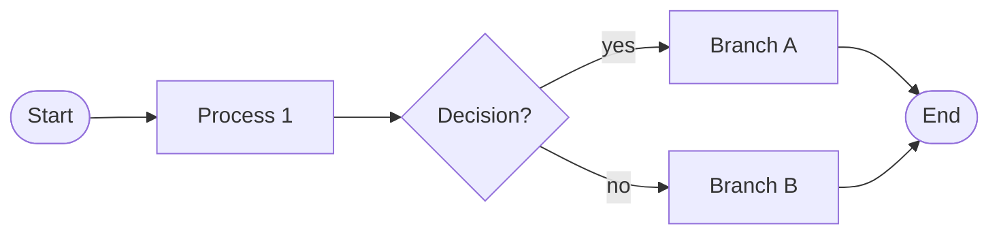
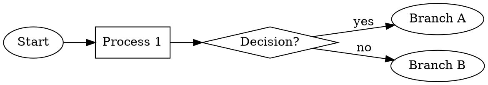

# 流程图 Prompt 框架（独立文档）

> 本文档是**自包含**的流程图 prompt 框架，集中解决"如何让 AI 图像生成模型画好一张学术流程图"。
> 涵盖 6 种流程图类型 + 标准形状语义 + 通用骨架 + 词汇库 + 调试技巧。
> 适用：GPT-Image-2 / DALL-E / Imagen 3 / nano banana / Midjourney（部分）。

---

# 目录

- [一、流程图是什么 & 何时用](#一流程图是什么--何时用)
- [二、形状语义标准（ISO 5807 简化版）](#二形状语义标准iso-5807-简化版)
- [三、流程图的 6 种类型](#三流程图的-6-种类型)
- [四、通用 Prompt 八段式骨架](#四通用-prompt-八段式骨架)
- [五、6 类完整 Prompt 模板](#五6-类完整-prompt-模板)
- [六、流程图专用词汇库](#六流程图专用词汇库)
- [七、颜色与线型语义规范](#七颜色与线型语义规范)
- [八、标准否定约束清单](#八标准否定约束清单)
- [九、调试常见问题](#九调试常见问题)
- [十、与代码流程图工具的协同](#十与代码流程图工具的协同)

---

# 一、流程图是什么 & 何时用

## 1.1 定义

**流程图（flowchart）** 是用**几何图形 + 箭头**表达一个过程"按时间或逻辑顺序展开的步骤"的示意图。

## 1.2 与相邻概念的区别

| 类型 | 强调点 | 典型节点 | 学术用途 |
|---|---|---|---|
| **流程图** | **过程展开** | 圆角矩形（过程）、菱形（判断）、圆（起止）| 算法步骤、实验流程、决策树 |
| **架构图** | 模块构成 | 任意几何形（盒子）| 系统总览、神经网络结构 |
| **数据流图（DFD）** | 数据流转 | 圆形（处理器）+ 圆柱（存储）| 信息系统设计 |
| **示意图** | 概念关系 | 任意自由形 | 文章插图、隐喻 |
| **时序图** | 时间先后 | 垂直泳道 + 横向箭头 | 协议、交互 |

⚠️ 学术写作中，**流程图 ≠ 架构图**。流程图回答"先做什么再做什么"，架构图回答"系统由什么组成"。混用会让审稿人困惑。

## 1.3 何时该用流程图（5 个判据）

✅ 任一满足即建议用流程图：
1. 你的方法有 ≥ 3 个**先后顺序**的步骤
2. 方法包含**条件分支**（if X then Y else Z）
3. 方法包含**循环/迭代**
4. 你想让读者按时间顺序"走一遍"流程
5. 你要画的是**算法**而不是结构

❌ 不适合用流程图（应该用架构图）：
- 模块同时并存、没有时序关系
- 强调"什么"而非"怎么做"
- 数据流为主（应该用 DFD）

---

# 二、形状语义标准（ISO 5807 简化版）

学术流程图遵循国际标准 **ISO 5807** 的形状语义。AI 图像生成模型不一定严格遵守，但 prompt 中说清楚后会显著提升输出质量。

## 2.1 标准形状速查

| 形状 | 用途 | 英文 prompt 关键词 |
|---|---|---|
| **圆角矩形 / 椭圆** | 起止（start / end） | `rounded rectangle with thick border` 或 `oval / ellipse` |
| **矩形 / 圆角矩形** | 处理过程（process / action） | `rounded rectangle` |
| **菱形** | 判断 / 分支（decision） | `diamond shape` |
| **平行四边形** | 输入 / 输出（input / output） | `parallelogram` |
| **梯形** | 人工操作（manual operation） | `trapezoid` |
| **圆柱** | 数据库 / 存储（database） | `cylinder` |
| **文档形** | 文件 / 报告（document） | `document shape with curved bottom` |
| **小圆 + 字母** | 连接器（off-page connector） | `small circle with letter inside` |
| **虚线框** | 子流程 / 范围（subprocess） | `dashed rectangle` |

## 2.2 在 prompt 中如何指定形状语义

```text
ELEMENTS:
- Start node: rounded oval, soft blue fill, label "Start"
- Process steps: rounded rectangles, soft gray fill
- Decision points: diamond shapes, soft orange fill, label as a yes/no question
- Data: parallelograms, soft green fill
- End node: rounded oval with thick black border, label "End"
```

---

# 三、流程图的 6 种类型

| # | 类型 | 一句话定义 | 典型学术场景 |
|---|---|---|---|
| 1 | **线性流程图** | 一条主线，A → B → C → D | 简单算法、实验步骤、数据预处理 |
| 2 | **分支流程图** | 含菱形判断节点，按条件分叉 | 决策算法、Case 分类、误差处理 |
| 3 | **并行流程图** | 多条并行支路，最后汇合 | 多线程算法、对照实验、消融 |
| 4 | **循环流程图** | 含闭环箭头，迭代直至条件满足 | 训练循环、迭代优化、EM 算法 |
| 5 | **嵌套 / 层级流程图** | 主流程中某节点展开为子流程 | 复杂多阶段方法、层级模型 |
| 6 | **泳道流程图** | 横向或纵向泳道区分角色 / 模块 | 多 agent 系统、Pipeline 跨阶段、人机交互 |

---

# 四、通用 Prompt 八段式骨架

任何流程图 prompt 都可以套这 8 段：

```text
[1] 一句话目标
A {flowchart_type} flowchart for an academic paper on {topic}.

[2] 整体布局
LAYOUT: {direction} flow, {N} nodes total, arranged {arrangement}.

[3] 节点清单（含形状语义）
NODES:
- Node 1: {shape} — label "{text}", {color_fill}
- Node 2: ...
- ...

[4] 连接清单（含方向和样式）
CONNECTIONS:
- Node 1 → Node 2: {arrow_style}, label "{edge_text}"
- Node 2 → Node 3 (yes): solid arrow, label "yes"
- Node 2 → Node 4 (no): solid arrow, label "no"
- Node 5 → Node 2: dashed feedback arrow, label "iterate"

[5] 文字规范
TEXT: All labels in {font}, {max_words_per_label} words max per node, title at top in bold.

[6] 风格关键词
STYLE: flat vector illustration, {venue}-quality, Arial sans-serif, pastel palette, white background.

[7] 否定约束
Negative constraints: NO photorealistic, NO 3D shading, NO cartoon, NO crossing arrows, NO unlabeled arrows, NO unreadable text, NO emoji, NO drop shadows.

[8] 参数化变量
{argument name="..." default="..."}
```

填完这 8 段，输出质量在 80 分以上。

---

# 五、6 类完整 Prompt 模板

下面 6 个模板是把第三节的 6 种类型 + 第四节的 8 段骨架**填满后的可直接复制版**。每个模板的 `{argument}` 参数可在调用时替换。

---

## 模板 1：线性流程图（Linear Flowchart）

适用：简单算法、实验步骤、数据预处理（**≥ 3 个先后顺序的步骤**）。

```text
A linear flowchart for an academic paper on {argument name="topic" default="data preprocessing"}.

LAYOUT: Horizontal flow from left to right, {argument name="num_steps" default="five"} nodes arranged in a single row with equal spacing.

NODES:
- Start: rounded oval with thick border, label "{argument name="start_label" default="Raw Data"}", soft blue fill #D6E4F0
- Step 1: rounded rectangle, label "{argument name="step1_label" default="Cleaning"}", soft gray fill #E5E7EB
- Step 2: rounded rectangle, label "{argument name="step2_label" default="Normalization"}", soft gray fill #E5E7EB
- Step 3: rounded rectangle, label "{argument name="step3_label" default="Feature Selection"}", soft gray fill #E5E7EB
- End: rounded oval with thick border, label "{argument name="end_label" default="Ready Dataset"}", soft green fill #D8E8D0

CONNECTIONS:
- Sequential solid black arrows (2-3 px) between adjacent nodes, all pointing right.
- Each arrow optionally labeled with a short verb in italic gray (max 3 words), e.g., "remove outliers", "scale to [0,1]".

TEXT:
- Title at top center, bold Arial: "{argument name="title" default="Data Preprocessing Pipeline"}"
- Node labels: bold Arial, ≤ 3 words each
- Arrow labels: italic gray, ≤ 3 words each

STYLE: flat vector illustration, NeurIPS/ICML figure aesthetic, Arial sans-serif throughout, pastel palette, pure white background. Aspect ratio 16:9.

Negative constraints: NO photorealistic photos, NO 3D shading, NO drop shadows, NO cartoon style, NO emoji, NO unreadable text, NO crossing arrows, NO bidirectional arrows (unidirectional flow only), NO chart junk.
```

---

## 模板 2：分支流程图（Branched / Decision Flowchart）

适用：决策算法、Case 分类、错误处理、规则系统。

```text
A branched flowchart with decision points for an academic paper on {argument name="topic" default="adaptive routing"}.

LAYOUT: Top-to-bottom vertical flow. Start at top, end at bottom. Branches expand horizontally at decision points.

NODES:
- Start: rounded oval with thick border, label "{argument name="start_label" default="Input Query"}", soft blue fill #D6E4F0
- Process A: rounded rectangle, label "{argument name="processA_label" default="Compute Score"}", soft gray fill
- Decision 1: diamond shape, label "{argument name="decision1_label" default="Score > τ?"}", soft orange fill #F5E0CB, with two outgoing branches
- Branch Yes (Process B): rounded rectangle (left), label "{argument name="branchYes_label" default="Use Fast Path"}", soft green fill #D8E8D0
- Branch No (Process C): rounded rectangle (right), label "{argument name="branchNo_label" default="Use Slow Path"}", soft red fill #E8D0D0
- Merge / End: rounded oval, label "{argument name="end_label" default="Output"}", thick border

CONNECTIONS:
- Start → Process A: solid arrow, no label
- Process A → Decision 1: solid arrow, no label
- Decision 1 → Branch Yes: solid arrow, label "yes" in italic gray near the start of the arrow
- Decision 1 → Branch No: solid arrow, label "no" in italic gray near the start of the arrow
- Branch Yes → End: solid arrow, curving slightly inward to merge
- Branch No → End: solid arrow, curving slightly inward to merge
- All arrows 2-3 px thick, solid black

TEXT:
- Title at top center, bold Arial: "{argument name="title" default="Decision-Based Routing"}"
- All node labels in bold Arial, ≤ 4 words each
- Decision label phrased as a yes/no question (ends with "?")

STYLE: flat vector, Arial sans-serif, pastel palette, pure white background, academic publication style. Aspect ratio 4:3 or 3:4 (vertical).

Negative constraints: NO photorealistic, NO 3D, NO drop shadows, NO cartoon, NO ambiguous arrows (every branch must be labeled), NO three-way decisions (use only binary decisions; for ternary use nested decisions), NO long sentences in nodes, NO emoji.
```

---

## 模板 3：并行流程图（Parallel Flowchart）

适用：多线程算法、对照实验、消融、并行处理。

```text
A parallel flowchart showing concurrent processes for an academic paper on {argument name="topic" default="ablation comparison"}.

LAYOUT: Horizontal top-to-bottom flow with a split-merge structure. One input at top splits into {argument name="num_parallel" default="three"} parallel paths, which then merge into one output at bottom.

NODES:
- Input: rounded oval, label "{argument name="input_label" default="Shared Input"}", soft blue fill #D6E4F0
- Fork (split point): small filled black circle (radius 6 px)
- Parallel branch 1 (left): rounded rectangle, label "{argument name="branch1_label" default="Method A"}", soft green fill #D8E8D0
- Parallel branch 2 (middle): rounded rectangle, label "{argument name="branch2_label" default="Method B"}", soft orange fill #F5E0CB
- Parallel branch 3 (right): rounded rectangle, label "{argument name="branch3_label" default="Method C"}", soft purple fill #E0D4EC
- Join (merge point): small filled black circle (radius 6 px)
- Output: rounded oval, label "{argument name="output_label" default="Comparison Result"}", soft gray fill

CONNECTIONS:
- Input → Fork: solid arrow downward
- Fork → 3 branches: solid arrows diverging downward to each branch
- Each branch → Join: solid arrows converging downward
- Join → Output: solid arrow downward
- Optionally, label each branch arrow with the differentiating aspect (e.g., "with feature X", "without feature X", "with feature Y")

OPTIONAL: To indicate strict parallelism, place a horizontal "fork bar" (thin solid black rectangle) at the split and join points instead of dots — UML-style.

TEXT:
- Title at top center, bold Arial: "{argument name="title" default="Parallel Method Comparison"}"
- Node labels: bold Arial, ≤ 4 words each
- A short caption at the bottom in italic gray: "All three branches share the same input and are evaluated under identical conditions."

STYLE: flat vector, academic publication aesthetic, Arial sans-serif, pastel palette, pure white background. Aspect ratio 3:4 (vertical) or 1:1.

Negative constraints: NO photorealistic, NO 3D, NO drop shadows, NO cartoon, NO crossing branch lines, NO unlabeled differentiation, NO arrows going upward (strict downward flow), NO emoji.
```

---

## 模板 4：循环流程图（Loop / Iterative Flowchart）

适用：训练循环、迭代优化、EM 算法、闭环控制。

```text
A loop flowchart for an academic paper on {argument name="topic" default="iterative training"}, emphasizing the iterative nature of the process.

LAYOUT: Vertical top-to-bottom main flow with one explicit feedback loop arrow returning from a lower node to an upper node.

NODES:
- Start: rounded oval, label "{argument name="start_label" default="Initialize Parameters"}", soft blue fill #D6E4F0
- Iterate step 1: rounded rectangle, label "{argument name="step1_label" default="Forward Pass"}", soft gray fill
- Iterate step 2: rounded rectangle, label "{argument name="step2_label" default="Compute Loss"}", soft gray fill
- Iterate step 3: rounded rectangle, label "{argument name="step3_label" default="Backward Pass"}", soft gray fill
- Iterate step 4: rounded rectangle, label "{argument name="step4_label" default="Update Parameters"}", soft gray fill
- Decision: diamond shape, label "{argument name="decision_label" default="Converged?"}", soft orange fill #F5E0CB
- End: rounded oval with thick border, label "{argument name="end_label" default="Final Model"}", soft green fill

CONNECTIONS:
- Sequential solid arrows downward: Start → Step 1 → Step 2 → Step 3 → Step 4 → Decision
- Decision → End: solid arrow downward, label "yes" in italic gray
- **Feedback arrow**: Decision → Step 1, drawn as a thick curved arrow on the right side of the diagram, going from the right side of the Decision diamond back up to the right side of Step 1. Label this arrow "no, iterate" in bold italic gray. Use a slightly different color (e.g., soft red #C44E52) to make it visually stand out.

TEXT:
- Title at top center, bold Arial: "{argument name="title" default="Iterative Optimization Loop"}"
- Node labels: bold Arial, ≤ 3 words each
- Side annotation at the right of the feedback arrow (small italic gray): "Repeat until {argument name="stop_criterion" default="loss converges"}"

STYLE: flat vector, ICLR / NeurIPS figure aesthetic, Arial sans-serif, pastel palette, pure white background. Aspect ratio 3:4 (vertical, taller than wide).

Negative constraints: NO photorealistic, NO 3D shading, NO drop shadows, NO cartoon, NO ambiguous feedback (the loop arrow must be visually distinct from the forward arrows), NO arrows crossing the main flow chaotically, NO emoji.
```

---

## 模板 5：嵌套 / 层级流程图（Hierarchical / Nested Flowchart）

适用：复杂多阶段方法、层级模型、子流程展开。

```text
A nested flowchart for an academic paper on {argument name="topic" default="multi-stage processing"}, where one of the high-level steps is expanded into a detailed sub-flowchart.

LAYOUT: Two-tier vertical flow.

TIER 1 (top, main flow): A horizontal high-level flow with {argument name="num_main_steps" default="four"} nodes:
- High-level step A: rounded rectangle, label "{argument name="stepA_label" default="Data Acquisition"}", soft blue fill
- High-level step B: rounded rectangle with a small "magnifying glass" icon on its top-right corner, label "{argument name="stepB_label" default="Feature Engineering"}", soft green fill — this is the "zoomed-in" step
- High-level step C: rounded rectangle, label "{argument name="stepC_label" default="Model Training"}", soft orange fill
- High-level step D: rounded rectangle, label "{argument name="stepD_label" default="Evaluation"}", soft purple fill

TIER 2 (bottom, expanded sub-flow): A large dashed rectangle (labeled "Step B Details" at top-left) containing 3-5 sub-process nodes:
- Sub-step B1: rounded rectangle, label "{argument name="subB1_label" default="Tokenize"}"
- Sub-step B2: rounded rectangle, label "{argument name="subB2_label" default="Embed"}"
- Sub-step B3: rounded rectangle, label "{argument name="subB3_label" default="Aggregate"}"
- (optional more sub-steps)

CONNECTIONS:
- Tier 1: Horizontal solid arrows A → B → C → D
- A thin dashed line (or two dashed lines) connecting High-level step B to the dashed sub-rectangle below, indicating "this is the expanded view"
- Tier 2: Horizontal solid arrows B1 → B2 → B3 within the dashed rectangle

TEXT:
- Title at top, bold Arial: "{argument name="title" default="Method Overview with Step B Expansion"}"
- All node labels in bold Arial, ≤ 3 words
- Caption below the dashed rectangle in italic gray: "Step B expanded for clarity."

STYLE: flat vector, academic publication style, Arial sans-serif, pastel palette, pure white background. Aspect ratio 16:9.

Negative constraints: NO photorealistic, NO 3D shading, NO heavy drop shadows, NO cartoon, NO ambiguous "expansion" markers (the dashed connection must be visually clear), NO emoji, NO overcrowded sub-flow (max 5 sub-steps).
```

---

## 模板 6：泳道流程图（Swimlane / Cross-Functional Flowchart）

适用：多 agent 系统、人机交互、跨模块协同。

```text
A swimlane flowchart for an academic paper on {argument name="topic" default="human-AI collaboration"}, showing how different actors / modules interact across a process.

LAYOUT: {argument name="num_lanes" default="three"} horizontal swimlanes stacked vertically. Each lane has a label on the left side.

LANES (from top to bottom):
- Lane 1: "{argument name="lane1_name" default="User"}", soft blue background tint #F0F4FA
- Lane 2: "{argument name="lane2_name" default="AI Agent"}", soft green background tint #F0FAF4
- Lane 3: "{argument name="lane3_name" default="External System"}", soft orange background tint #FAF4F0

Lane separators: thin gray horizontal lines (1 px).

NODES (placed within appropriate lane to show responsibility):
- Step 1 (Lane 1): rounded rectangle, label "{argument name="step1_label" default="Submit Query"}"
- Step 2 (Lane 2): rounded rectangle, label "{argument name="step2_label" default="Parse Intent"}"
- Step 3 (Lane 2): rounded rectangle, label "{argument name="step3_label" default="Call API"}"
- Step 4 (Lane 3): rounded rectangle, label "{argument name="step4_label" default="Return Data"}"
- Step 5 (Lane 2): rounded rectangle, label "{argument name="step5_label" default="Synthesize Response"}"
- Step 6 (Lane 1): rounded rectangle, label "{argument name="step6_label" default="Receive Answer"}"

CONNECTIONS:
- Step 1 → Step 2: solid arrow crossing Lane 1 → Lane 2 boundary downward, optionally labeled with the message type
- Step 2 → Step 3: solid arrow within Lane 2
- Step 3 → Step 4: solid arrow crossing Lane 2 → Lane 3 boundary downward, optionally labeled "request"
- Step 4 → Step 5: solid arrow crossing Lane 3 → Lane 2 boundary upward, optionally labeled "response"
- Step 5 → Step 6: solid arrow crossing Lane 2 → Lane 1 boundary upward
- All arrows 2-3 px solid black

TEXT:
- Title at top center, bold Arial: "{argument name="title" default="User-AI Interaction Flow"}"
- Lane labels: bold Arial, vertically centered on the left edge of each lane
- Node labels: bold Arial, ≤ 3 words

STYLE: flat vector, academic infographic aesthetic, Arial sans-serif, pastel palette, pure white background base with subtle lane tints. Aspect ratio 16:9 or wider.

Negative constraints: NO photorealistic, NO 3D shading, NO drop shadows, NO cartoon, NO arrows that skip lanes (every cross-lane arrow must visibly cross the lane boundary), NO emoji, NO chart junk, NO over-saturated lane background tints (must stay subtle).
```

---

# 六、流程图专用词汇库

## 6.1 节点类型词汇

| 节点用途 | 推荐 prompt 词 |
|---|---|
| 起止 | `rounded oval`, `pill-shaped`, `stadium shape` |
| 过程 | `rounded rectangle`, `rounded-corner box` |
| 判断 | `diamond shape`, `rhombus` |
| 输入输出 | `parallelogram` |
| 数据库 | `cylinder shape`, `database can icon` |
| 文档 | `document shape with curved wavy bottom edge` |
| 子流程 | `dashed rectangle`, `rectangle with double vertical lines on sides` |
| 连接器 | `small circle with a letter (A, B, ...) inside` |

## 6.2 箭头类型词汇

| 箭头用途 | 推荐 prompt 词 |
|---|---|
| 主流向 | `solid black arrow, 2-3 px thick` |
| 反馈 / 循环 | `curved arrow returning to an earlier step, slightly different color (e.g., soft red)` |
| 数据流 | `thick solid arrow, 4-6 px, gray` |
| 控制信号 | `thin dashed arrow, 1-2 px` |
| 可选路径 | `dotted arrow` |
| 同步 / 并行 | `horizontal fork bar (thin solid black rectangle)` |

## 6.3 布局方向词汇

| 布局 | prompt 词 |
|---|---|
| 横向左右 | `horizontal flow from left to right` |
| 纵向上下 | `vertical flow from top to bottom` |
| 蛇形 | `serpentine layout, zigzag flow` |
| 圆环 | `circular layout, clockwise` |
| 树状 | `tree layout with one root at top and branches expanding downward` |
| 泳道 | `swimlane layout, {N} horizontal lanes` |

## 6.4 强调和层次词汇

| 用途 | prompt 词 |
|---|---|
| 突出关键节点 | `thicker border (4 px) and slightly larger size` |
| 弱化辅助节点 | `lighter fill, dashed border` |
| 起点标识 | `with a small green dot icon on the top-left` |
| 终点标识 | `with a small flag icon or "✓" mark` |
| 分组 | `surround related nodes with a thin dashed rectangle labeled with the group name` |

---

# 七、颜色与线型语义规范

## 7.1 颜色语义（建议遵循的"通用心智模型"）

| 颜色 | 推荐用途 | 十六进制（soft）|
|---|---|---|
| 蓝色 | 输入 / 起点 / 数据源 | `#D6E4F0` |
| 绿色 | 正确路径 / 成功 / 通过 | `#D8E8D0` |
| 红色 | 错误路径 / 失败 / 拒绝 | `#E8D0D0` |
| 黄 / 橙色 | 判断点 / 警告 / 中间状态 | `#F5E0CB` |
| 紫色 | 特殊处理 / 关键模块 | `#E0D4EC` |
| 灰色 | 普通过程 / 中性节点 | `#E5E7EB` |

**用法准则**：
- 同一图中同一种语义只用同一种颜色
- 一张图最多 4-5 种颜色，超过会"乱"
- 色盲友好：不要仅靠"红绿"区分语义，加上文字或形状辅助

## 7.2 线型语义

| 线型 | 含义 |
|---|---|
| 实线（solid） | 主流向 / 必然路径 |
| 虚线（dashed） | 可选 / 辅助 / 反馈 |
| 点线（dotted） | 弱关联 / 引用 / 注释 |
| 双线（double） | 强调 / 数据复制 |

---

# 八、标准否定约束清单

任何流程图 prompt 末尾**必加**：

```text
Negative constraints: 
NO photorealistic photos, 
NO 3D shading or drop shadows, 
NO cartoon style or childish illustrations, 
NO unreadable text (font size below 8 pt at print resolution), 
NO crossing arrows that overlap visually, 
NO unlabeled decision branches (yes/no must always be labeled), 
NO bidirectional arrows where unidirectional is intended, 
NO inconsistent shape semantics (e.g., diamonds used as processes), 
NO emoji or decorative icons that distract from the content, 
NO logos or watermarks, 
NO over-saturated colors (all colors must be pastel / muted), 
NO heavy gradients, 
NO chart junk (axes, gridlines, or scales that flowcharts don't need).
```

---

# 九、调试常见问题

## 9.1 节点形状错配

**症状**：菱形被画成圆角矩形，或圆角矩形被画成纯方形。

**解决**：
- 用更精确的形状词："diamond shape" 替代 "rhombus" 或 "decision box"
- 加约束："the decision node must be a diamond (rhombus) with 4 corners, not a rectangle"
- 把形状词放在节点描述的**最前面**，模型权重更高

## 9.2 箭头方向错乱

**症状**：原本应该右流的箭头，模型画成了上下乱走的。

**解决**：
- 明确总体方向："all main flow arrows point strictly from left to right"
- 区分主流和反馈："main flow arrows point right; feedback arrow is the ONLY arrow pointing left"
- 加 "arrows do not cross each other; route them around nodes with right-angle turns"

## 9.3 判断节点没标 yes/no

**症状**：菱形节点的两个出口箭头没有 "yes" / "no" 标签。

**解决**：
- 在 prompt 中**显式列出**每个箭头的标签
- 加："every arrow leaving a decision diamond MUST be labeled with the corresponding outcome ('yes' / 'no' or specific condition values)"

## 9.4 循环箭头看不出来

**症状**：feedback 箭头被画得和正向箭头一样，看不出"回到上一步"的含义。

**解决**：
- 强制要求颜色不同："feedback arrow must use a distinct color (soft red) different from the forward arrows"
- 强制要求线型不同："feedback arrow drawn as a thicker curved line"
- 必须加标签：feedback arrow labeled with words like "iterate", "repeat", "loop back"

## 9.5 泳道之间分不清

**症状**：泳道流程图各 lane 之间区分度低，看不出谁负责什么。

**解决**：
- 给每条 lane 加 subtle background tint（淡色）
- lane 之间用 1-2 px 实线分隔
- lane label 用粗体加 vertical 排列（如果空间有限）
- 跨 lane 箭头明确说 "crossing Lane X → Lane Y boundary"

## 9.6 整体太密

**症状**：节点挤在一起，箭头交错。

**解决**：
- 加 "with generous whitespace, at least 60 px between adjacent nodes"
- 减少节点数（>10 节点考虑拆成两张图或加嵌套）
- 加 "sparse layout, generous margins"

## 9.7 文字看不清

**症状**：节点内文字太小或被截断。

**解决**：
- 限制每节点字数："max 3 words per node label"
- 强制字号："all node labels at minimum 14 pt"
- 节点尺寸："node size auto-fits the text with 16 px padding"

---

# 十、与代码流程图工具的协同

如果你不依赖图像生成模型，可以用以下**代码方式**生成确定性更高的流程图。本框架的形状语义和词汇库同样适用。

## 10.1 Mermaid（推荐快速画法）



特点：
- 文本驱动，易版本控制
- GitHub / Notion / VSCode 原生支持
- 可导出 SVG / PNG

## 10.2 Graphviz / DOT



特点：
- 自动布局算法非常成熟
- 适合大规模复杂图（>50 节点）
- LaTeX 直接通过 `\input{}` 使用

## 10.3 TikZ（LaTeX 原生，论文最佳）

```latex
\begin{tikzpicture}[node distance=2cm]
  \node[draw, rounded corners] (start) {Start};
  \node[draw, right of=start] (proc) {Process};
  \node[draw, diamond, right of=proc] (dec) {?};
  \draw[->] (start) -- (proc);
  \draw[->] (proc) -- (dec);
\end{tikzpicture}
```

特点：
- 论文期刊原生兼容，字体和正文一致
- 矢量、可缩放、永远清晰
- 学习曲线较陡，但生产价值最高

## 10.4 何时用图像生成模型 vs 何时用代码工具

| 场景 | 推荐 |
|---|---|
| 探索性、快速试错、需要"有美感" | 图像生成模型（GPT-Image-2 / DALL-E）|
| 投稿要求矢量、可编辑 | TikZ / Mermaid SVG |
| 流程图节点 < 10 | 任意 |
| 流程图节点 > 20 | Graphviz / DOT |
| 团队协作、版本控制 | Mermaid（文本即文件）|
| 美学要求极高 + 期刊已接受 PNG | 图像生成模型 |

---

# 附录：完整使用示例

**用户输入**：
> 帮我画一张训练循环的流程图，包括前向传播、损失计算、反向传播、参数更新，最后判断是否收敛。

**Claude 应该这样响应**：

1. 识别这是**循环流程图**（含判断 + 闭环），选用**模板 4**
2. 提取参数：
   - `topic` = "iterative training"
   - `start_label` = "Initialize Parameters"
   - `step1_label` = "Forward Pass"
   - `step2_label` = "Compute Loss"
   - `step3_label` = "Backward Pass"
   - `step4_label` = "Update Parameters"
   - `decision_label` = "Converged?"
   - `end_label` = "Final Model"
   - `stop_criterion` = "loss converges"
   - `title` = "Iterative Training Loop"
3. 填好模板，输出完整 prompt
4. 附上模板编号 + 调优提示

整个过程不需要用户再翻文档。
